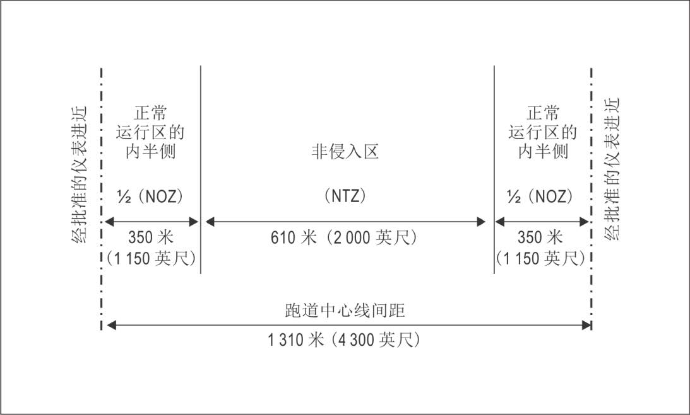

# 平行或近似平行跑道运行

Parallel or Near-Parallel Runway operations

## 一、简介

平行跑道或相似平行跑道的运行，自古以来就是一个**难题**，而在中国大陆境内，考虑到日益增长的客流量，各机场在不断扩建后，各类跑道拔地而起。因此，管制员应熟练掌握本部分内容，并作为记忆项目背诵。

平行跑道的同时仪表运行应在运行前取得民航总局审批。但，存在少数机场存在平行跑道，开放而未取得许可。针对这种情况，我们推荐使用隔离平行运行模式，尽量接近真实。

## 二、运行模式

按照[《平行跑道同时仪表运行管理规定》](http://www.caac.gov.cn/XXGK/XXGK/MHGZ/202304/P020230414612653535333.pdf)有关规定，在中国大陆境内，平行跑道同时仪表运行按照跑道用于进近和离场的使用方式分为**四种**：

- 独立平行仪表进近
- 相关平行仪表进近
- 独立平行离场
- 隔离平行运行

除此以外，也可以分为**两种**：

- 半混合运行
- 混合运行

### 总结

- 独立平行仪表进近、独立平行离场：基本可以不用管间隔，随便落都能落得下去。

- 相关平行仪表进近：需要看间隔。

- 隔离平行运行：互不干扰不用管。

接下来会详细的阐述这几种的区别和具体要求（本文本将不阐述一些硬性设施的要求[什么ILS吧啦吧啦的东西]~~你又不是建机场的看个der~~）。

## 三、独立平行仪表进近

1. 定义：在相邻的平行跑道仪表着陆系统上进近的航空器之间不需要配备规定的雷达间隔时，在平行跑道上同时进行的仪表着陆系统进近的运行模式。

2. 跑道间距条件：两条平行跑道中心线的间距不小于1035米时。

3. 管制员要求：

    - 在航空器管制员和进近管制建立通信联络后，尽早告知正在实施独立平行仪表进近并告知其使用的跑道号。此项情报可以通过ATIS广播提供。

    - 雷达屏幕上已显示NTZ（非侵入区）

    - 雷达引导航空器切入仪表着陆系统航向道时，最后的引导必须能够使得航空器以不大于30度的角度切入航向道，并且在切入前至少有2千米的直线平飞阶段。且，在建立下滑道之前，至少有4千米的平飞阶段。

        !!! Note "注意了解"
            

            即，不得进行**程序转弯**。

    - 在已建立的仪表着陆系统航向道上向台飞行且在正常运行区内飞行时，可以忽略不小于300米的垂直间隔或者5.6千米的雷达间隔（对侧飞机）。但，仍需注意同航道的飞机仍然有以上限制并不得解除（不包括航空器尾流）。

    - 使用“高边”和“低边”进行引导，“高边”和“低边”航空器在建立各自的航向道之前有300米的高度差。

    - 在截获下滑道后，发布可以继续通过ILS进近的许可。

    - 监视航空器不进入非侵入区，同时保证航空器之间存在安全间隔。如进入，则及时引导回到正确航迹，且引导受影响的航空器（同侧或对侧）立即爬升和转弯到指定的高度和航向，以避开偏航的航空器。

    - 管制员需要对机场有持续的雷达监视，保证雷达管制员能够随时掌握使用目视间隔的情况。但，如航空器驾驶员：

      - 航空器之间已经建立了目视间隔；
      - 航空器已经着陆；
      - 航空器复飞至距离跑道起飞末端外至少2千米并且与其他航空器之间已经建立安全间隔。

      则，可以不再监视。通常来讲管制员不再需要通知机组雷达监视服务已终止。

    - 恶劣气象条件下，及时中止平行跑道独立平行仪表进近。

4. 示意图：

    

    

### 非侵入区（NTZ）

1. 定义：位于相邻跑道中心线延长线之间的特定空域。以保证航空器偏离航向道时的飞行安全。
2. 划分：同前文所述，本部分将不再赘述，有兴趣的可以查阅《[平行跑道同时仪表运行管理规定.中国民用航空总局.CCAR-98TM](http://www.caac.gov.cn/XXGK/XXGK/MHGZ/202304/P020230414612653535333.pdf)》

### 正常运行区（NOZ）

1. 定义：从仪表着陆系统（ILS）航向道中心线向两侧延伸至指定范围内的空域。
2. 划分：同上。

!!! Note "注意了解"
	
	在模拟飞行中，不是这个机场拥有独立平行仪表进近的能力即可。
	
	一般情况下，我们**不推荐**拥有该资质的机场进行此运行模式。涉及到多方面的角度，在这里不再展开（ ~~偷偷说一下，你的TCAS会疯狂响哦~~ ）。

## 四、相关平行仪表进近

1. 定义：在相邻的平行跑道仪表着陆系统上进近的航空器之间需要配备规定的雷达间隔时，在平行跑道上同时进行的仪表着陆系统进近的运行模式。

2. 跑道间距条件：两条平行跑道中心线的间距不小于915米时。

3. 管制员要求：

    - 进近管制告知航空器管制员，两条跑道均可进近。此项情报可以通过ATIS广播提供。

    - 在引导航空器切入平行仪表着陆系统航向道时，管制员应当为航空器提供不小于300米的垂直间隔或者5.6千米的雷达间隔。

    - 已建立仪表着陆系统航向道的航空器之间（同侧、对侧）的雷达间隔应当符合下列规定：

      - 在同一个仪表着陆系统航向道上的航空器（同侧）之间的雷达间隔不小于5.6千米。

         航空器之间存在尾流影响的，应当符合中规定的尾流间隔； 

      - 在两条相邻的仪表着陆系统航向道上同时进近的航空器（对侧）之间的雷达间隔不小于4千米。

## 五、独立平行离场

1. 定义：离场航空器在平行跑道上沿相同方向同时起飞的运行模式。但是，当两条平行跑道的间距小于760米，航空器可能受尾流影响时，平行跑道离场航空器的放行间隔应当按照为一条跑道规定的放行间隔执行。
2. 跑道间距条件：两条平行跑道中心线的间距不小于760米时。
3. 管制员要求：
    - 按照分配的标准程序离场。

## 六、隔离平行运行

1. 定义：在平行跑道上同时进行的运行，其中一条跑道只用于离场，另一条跑道只用于进近。
2. 跑道间距条件：两条平行跑道中心线的间距不小于 760 米时，出现下列情形的，跑道中心线的间距应当符合下列规定：
    - 以进近的方向为准，当进近使用的跑道入口相对于离场跑道入口每向后错开150 米时，平行跑道中心线的最小间距可以减少 30 米，但平行跑道中心线的间距最小不得小于 300 米，具体要求在后文会进一步阐述； 
    - 以进近的方向为准，当进近使用的跑道入口相对于离场跑道入口每向前错开150米时，平行跑道中心线的最小间距应当增加 30 米，具体要求在后文会进一步阐述。
3. 管制员要求：
    - 可以要求机组进行：仪表着陆系统精密进近（ILS）或目视进近（VA）。

## 七、半混合及混合运行

### 半混合运行

适用以下情形：

- 一条跑道只用于进近，另一条跑道按照独立平行仪表进近模式或者相关平行仪表进 近模式用于进近，或者按照隔离平行运行模式用于离场；

- 一条跑道只用于离场，另一条跑道按照隔离平行运行模式用于进近，或者按照独立 平行离场模式用于离场。

### 混合运行

1. 定义：两条平行跑道可以同时用于进近和离场。

## 参考资料

[1] [平行或近似平行仪表跑道同时运行 (SOIR) 手册.第二版, 2020 年.Doc 9643.ISBN 978-92-9258-916-5](https://www.unitingaviation.com/livecycle/Documents/ICAO_Doc_9643-2_CH.pdf)

[2] [平行跑道同时仪表运行管理规定.中国民用航空总局.CCAR-98TM](http://www.caac.gov.cn/XXGK/XXGK/MHGZ/202304/P020230414612653535333.pdf)
