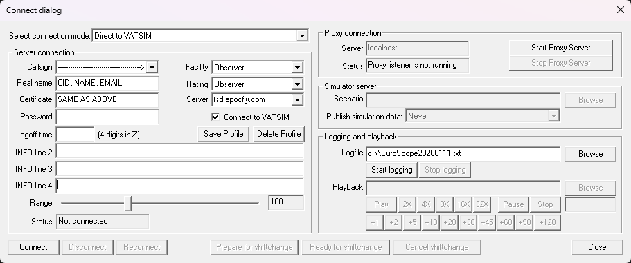
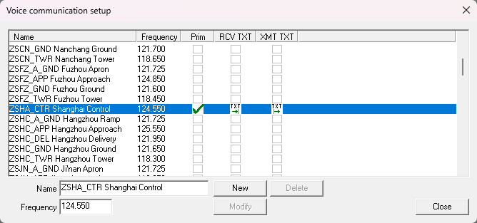
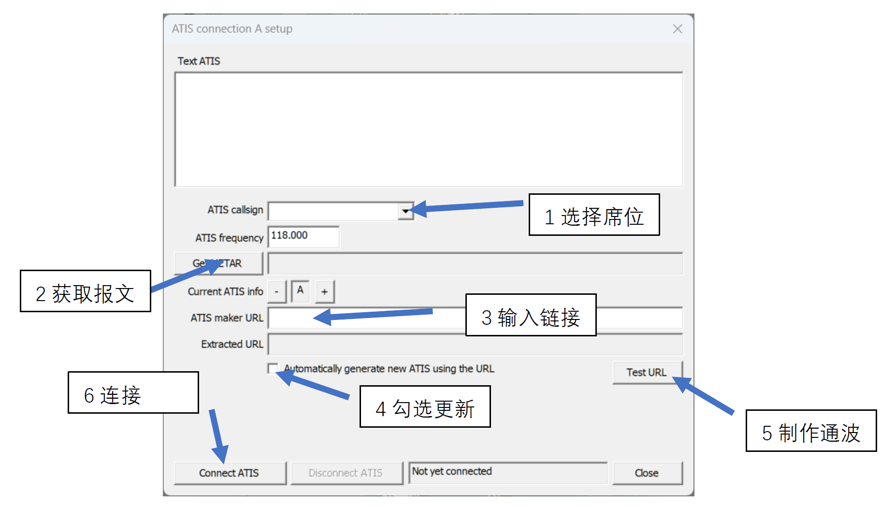
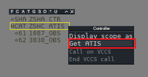
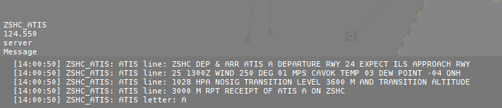

# EuroScope 标准操作流程

EuroScope standard operating procedure

## 总则

为规范 EuroScope（下文都简称为ES）在 APOCFLY 模拟飞行平台的应用，明确相关操作要求与执行标准，特制定本文件。本文件旨在对[《Flyatcsim EuroScope 扇区使用教程》](../Learning_Center/References/Flyatcsim%20EuroScope扇区使用教程%20v1.2.pdf)进行补充与细化，并结合 APOCFLY 平台实际运行环境，提供具备可操作性的程序指引。

全体 APOCFLY 管制员均应遵循本文件所列之标准操作流程。如在具体情境中遇到与本文件不一致或存在疑问的情况，可在确保安全与协调的前提下，经评估后临时调整执行方式。

若本文件与所引用教程存在差异，应以本文件规定为准。

## 航前准备

每一位管制员在上管之前，都应该查看有关[ES版本](#es)、[SOP](#sop)、[Loa](#loa)、[航行资料汇编（航图）](#_3)、[最新的扇区](#_4)。

### ES


ES的版本总是非常重要的。目前而言，我们推荐每一位管制员使用ES __v3.2.11__ 进行上管。

下载链接：[官方链接](https://euroscope.hu/install/EuroScopeSetup.3.2.11.msi)、[网盘下载](https://file.apocfly.com/d/apocfly/EuroScope/EuroScopeSetup.3.2.11.msi?sign=wG06J5Z32Ai757tH-ByEHaGEdrF33ZqzLseCe5D5Vis=:0)

### SOP

SOP主要在文档站的SOP专栏可以查看。其次，有部分空域的标准运行规则，我们暂时无法独立完成。因此，请前往：[https://www.vatprc.net/zh-cn/airspace/sop](https://www.vatprc.net/zh-cn/airspace/sop)

同样的，任何文档都可能产生错误或冲突，请你优先采用本文档站的意见。

!!! Note "注意了解"

	这并不意味着您可以不看VATPRC出品的SOP了，而是需要两者相结合在一起。

### Loa

Loa部分与SOP同理，您可前往：[https://www.vatprc.net/zh-cn/controller/loa](https://www.vatprc.net/zh-cn/controller/loa)

Loa主要用于中国大陆与港、澳、台及国际地区移交机组使用的，大部分情况下是向外移交。

### 航图

目前航图有许多方式进行查询，我们最推荐使用eAIP航图及其镜像站。您可前往APOC架设的镜像站：[https://eaip.apocfly.com/](https://eaip.apocfly.com/)

航图需要重点留意的部分：机场细则-跑道运行模式, 低能见度运行模式(极端天气下), 非全跑道起飞距离、进离场航图-TA, TL, (TH)、进近图-截盲高, 复飞高度/程序。

### 扇区

扇区目前主流有两种：[China-Mainland-Sector](https://github.com/Master-Gui-Studio/China-Mainland-Sector)、[Flyatcsim Sector Package](https://mbd.pub/o/bread/Zpqcmp9w)。

这两个扇区的更新速度应为一致的，所有管制员不论使用哪种，必须保证扇区和当期AIRAC不超过3期变化。

[//]: # (<iframe src="https://airac-cycles.vercel.app/cycle/2026-01" style="width: 5000px;height: 600px; border-radius: 15px;"></iframe>)

## 安装插件

EuroScope软件在连接至APOCFLY网络前，必须前往：[网盘下载](https://file.apocfly.com/d/apocfly/EuroScope/Plugins/EuroScopeInjector.dll?sign=SMW3cOk_5khRwL3XAVMxbKkZsjfHhjHISt0G0YR69gU=:0) 或 空管中心QQ群内进行插件下载。

部分扇区，例如: [China-Mainland-Sector](https://github.com/Master-Gui-Studio/China-Mainland-Sector)等扇区，已内置此插件，您可能仅需要动动配置文件或不用动任何事即可。

下载完成后，将选择 `EuroScopeInjector.dll` 其放在在任何位置（只要你能找到的）

打开扇区 -> Other setting -> Plug-ins -> Load -> 选择EuroScopeInjector.dll -> Close

!!! Note "注意了解"

	由于 [EuroScopeInjector.dll](https://file.apocfly.com/d/apocfly/EuroScope/Plugins/EuroScopeInjector.dll?sign=SMW3cOk_5khRwL3XAVMxbKkZsjfHhjHISt0G0YR69gU=:0) 暂时不集成 [Radio Direction Finder](https://github.com/KingfuChan/MTEPlugin-for-EuroScope) 功能，不需要给予插件绘制权限。

## 连接至服务器



- Select connection mode处：
    - 如果是日常上管选择 Direct to VATSIM；
    - 模拟机训练选择 Start Simulator/Sweatbox simulator session；
- 在上管前，提前查阅SOP、航图等航前资料，准备好后再上管。
- Callsign处：必须通过"▽"进行席位的**选择**，禁止填写。

	!!! Note "注意了解"
	
		如果是OBS，则将"*_OBS" 改为 "CID_OBS"，此处的CID为注册CID。例如：5516_OBS。

- Realname处：必须填写注册CID、注册昵称、注册邮箱中任意一个（QQ号因在注册时不强制填写，故不作为身份的识别，不能在此处填写）[CoC 2.9](../../General/OPDOC-General-202502-R2-SC/?h=%E5%90%88%E7%90%86%E7%9A%84%E5%90%8D%E7%A7%B0#_5)
- Rating处：按照**管制权限**的最高填写，此处的管制权限特指：OBS-C3。而如果是教员上XXXX_I_XXX，则可以使用I1-I3的最高教员权限进行。请勿在单独上管中填写I1-I3。
	
	!!! Tip "总而言之"
	
		如果您仅是一位管制员，填写最高权限即可。

- CID处：同Realname原则填写。
- Server处：fsd.apocfly.com
- Logoff time处：可留空，填写自己的下管UTC时。格式：HHMM
- [✓] Connect to VATSIM
- ATC INFO栏：部分扇区默认INFO填写有Hoppie CPDLC Login Code，如果您尚未了解清楚此部分内容，请删去。Hoppie CPDLC 服务器推荐使用[PDASIM]。任何机组使用CPDLC/DCL前，必须向管制员再次询问是否可用。
- Range处：按照[CoC 4.6](../../General/OPDOC-General-202502-R2-SC/?h=%E9%81%B5%E5%BE%AA%E8%A7%86%E7%A8%8B%E8%B7%9D%E7%A6%BB%E8%A7%84%E5%AE%9A#_7)有关范围进行填写

## 通讯面板

++lbutton_cn++ ，即可进入通讯面板。



此部分内容需要特别注意的是：

- OBS严禁勾选`Prim`(主频率)，仅允许勾选`RCV TXT`
- 如果教员监管学员时应勾选主频率，且同时勾选`RCV TXT`, `XMT TXT`

## 架设ATIS

这里以Flyatcsim的扇区进行演示，也同样建议您按照此举进行设置。

!!! Warning "注意"

	请先**开跑道**并做出上管准备后，再进行ATIS的架设。

### 选择URL

此部分内容Flyatcsim已内置。但，管制员仍然需要了解此部分内容，避免扇区故障。

在您的ES顶部菜单栏有以下：

从左到右我们分别给予字母代号为：ATIS·1、ATIS·2、ATIS·3、ATIS·4。

- 进离场(DEP & ARR) [XXXX_ATIS]通波：ATIS·1或ATIS·4
	
	ATIS·1
	```
	http://atis.flyatcsim.club/atis.php?type=B&metar=$metar($atisairportA)&code=$atiscodeA&dep_runway=$deprwy($atisairportA)&arr_runway=$arrrwy($atisairportA)
	```
    ATIS·4
	```
    http://atis.flyatcsim.club/atis.php?type=B&metar=$metar($atisairportD)&code=$atiscodeD&dep_runway=$deprwy($atisairportD)&arr_runway=$arrrwy($atisairportD)
	```

- 离场(DEP) [XXXX_D_ATIS]通波：ATIS·2
	
	ATIS·2
	```
	http://atis.flyatcsim.club/atis.php?type=D&metar=$metar($atisairportB)&code=$atiscodeB&dep_runway=$deprwy($atisairportB)&arr_runway=$arrrwy($atisairportB)
	```

- 进场(ARR) [XXXX_A_ATIS]通波：ATIS·3
	
	ATIS·3
	```
	http://atis.flyatcsim.club/atis.php?type=A&metar=$metar($atisairportC)&code=$atiscodeC&dep_runway=$deprwy($atisairportC)&arr_runway=$arrrwy($atisairportC)
	```

??? Example "特殊情况(ES版本过久)"

	如果您的ES版本过久，仅有一个ATIS架设窗口，则对应的URL为：
	
	- 进离场(DEP & ARR) [XXXX_ATIS]通波：
	```
	http://atis.flyatcsim.club/atis.php?type=B&metar=$metar($atisairport)&code=$atiscode&dep_runway=$deprwy($atisairport)&arr_runway=$arrrwy($atisairport)
	```
	- 离场(DEP) [XXXX_D_ATIS]通波：
	```
	http://atis.flyatcsim.club/atis.php?type=D&metar=$metar($atisairport)&code=$atiscode&dep_runway=$deprwy($atisairport)&arr_runway=$arrrwy($atisairport)
	```
	- 进场(ARR) [XXXX_A_ATIS]通波：
	```
	http://atis.flyatcsim.club/atis.php?type=A&metar=$metar($atisairport)&code=$atiscode&dep_runway=$deprwy($atisairport)&arr_runway=$arrrwy($atisairport)
	```
	
	但，我们强烈**不推荐**使用此版本的ES，请按照[此部分内容](#es)更新您的ES。

### 部署ATIS

示意图如下：



按照上图的流程进行制作ATIS。
!!! Note "注意了解"

	如果该机场的METAR报文，您的ES无法获取到，则可以不对此机场架设。



对着制作好的ATIS ++rbutton_cn++ 点击`Get ATIS`

在底部聊天框内会弹出ATIS文本。



[//]: # (<iframe><audio src="./assets/new_atis.wav"></audio></iframe>)

## DCL放行教程

未完待续，原则上应与CPDLC SOP位置保持一致，在前部仅仅作索引使用。

您可以先查看空管中心由 @ 5516 和 @ 1185 制作的视频。 