# TeamSpeak 使用教程

TeamSpeak Tutorial

## 下载方式

### TeanSpeak 3 本体

!!! Warning "温馨提示"

	请勿从从 **TS中文网** 下载 TeamSpeak3，[查看原因](https://teamspeak.app/docs/advanced/why-not-ts-cn/)。

| 下载链接                                                     | 备注     |
| ------------------------------------------------------------ | -------- |
| [APOCFLY网盘](https://file.apocfly.com/d/apocfly/%E8%BF%9E%E9%A3%9E%E8%BD%AF%E4%BB%B6/TeamSpeak3-Client-win64-3.6.2.exe?sign=bui5VsgMzffI9viiIY5hc_E6U2-3YoouXgOME2tnlaU=:0) | 较为推荐 |
| [官方直链](https://files.teamspeak-services.com/releases/client/3.6.2/TeamSpeak3-Client-win64-3.6.2.exe) | 下载较慢 |

```
SHA256: eab9e0c1a7134643e5f7116b7e0e58faffb20d6db528f8b333d2c2b5d1ab68ae
```

### TeamSpeak 3 汉化包

| 下载链接                                                     | 备注     |
| ------------------------------------------------------------ | -------- |
| [APOCFLY网盘](https://file.apocfly.com/d/apocfly/%E8%BF%9E%E9%A3%9E%E8%BD%AF%E4%BB%B6/Chinese_Translation_zh-CN_%E4%B8%AD%E6%96%87%E7%BF%BB%E8%AF%91%E5%8C%85.ts3_translation?sign=0J143xcJ6cVZGyYgKLrXwuxtSb-agHTVirjU56YGoLs=:0) | 较为推荐 |
| [官方直链](https://dl.tmspk.wiki/https:/github.com/VigorousPro/TS3-Translation_zh-CN/releases/download/snapshot/Chinese_Translation_zh-CN.ts3_translation) | 下载较慢 |

## 正式安装

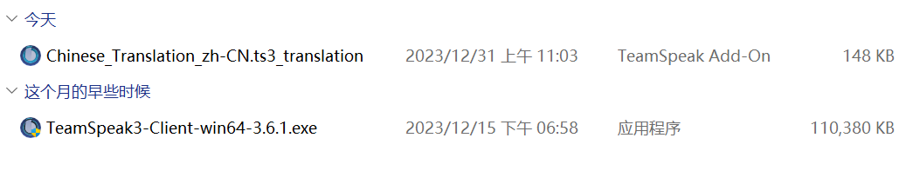

*注：本教程以TeamSpeak3-Client-win64-3.6.1为素材制作，目前可能版本过久，但内容近似。*

1. 打开"TeamSpeak3-Client-win64-3.6.1.exe"

	
	
	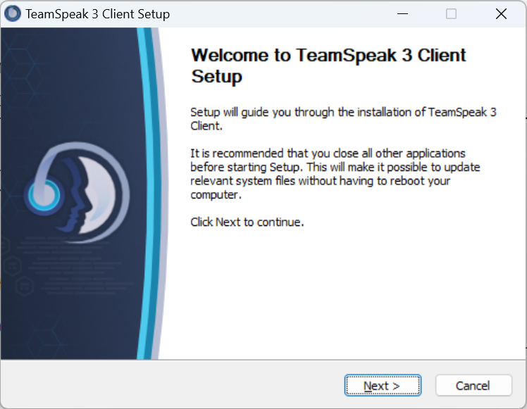

2. 划到最底下，同意协议

	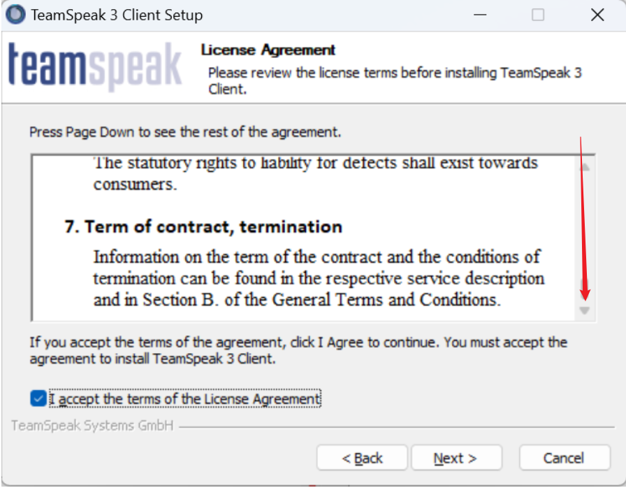

3. 选择安装用户，默认即可

	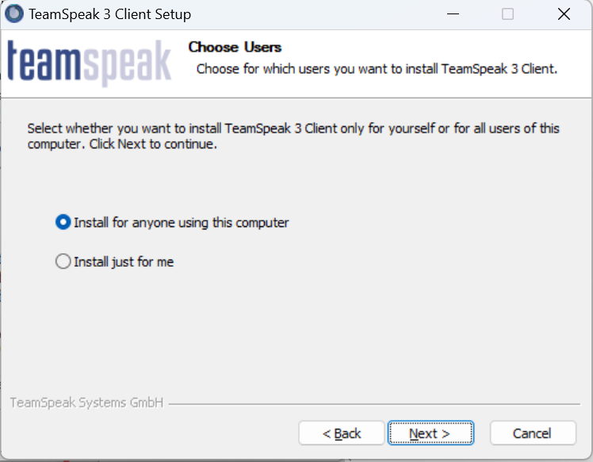

4. 选择安装目录，默认即可

	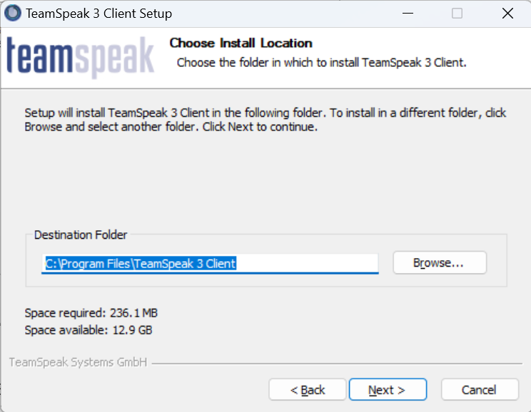
	
	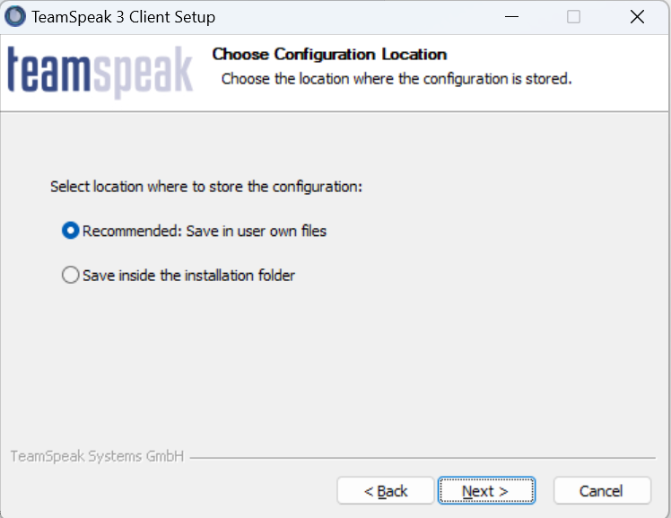
	
	
	
	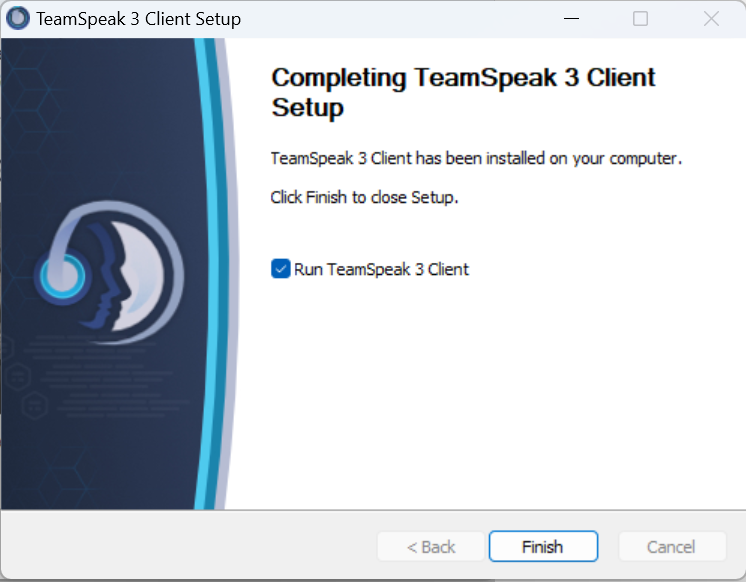

5. 完成安装，弹出以下界面并关闭

	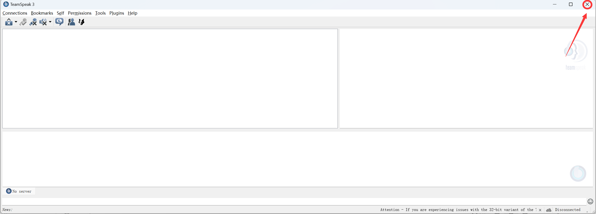

---

接下来安装汉化

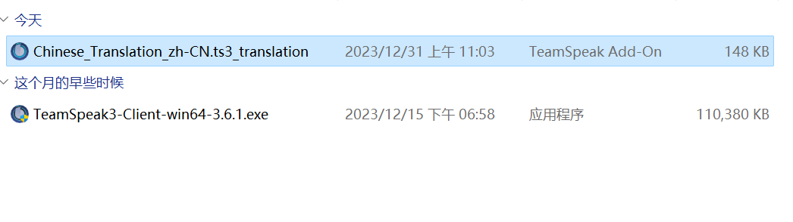

1. 打开"Chinese_Translation_zh-CN.ts3_translation"

	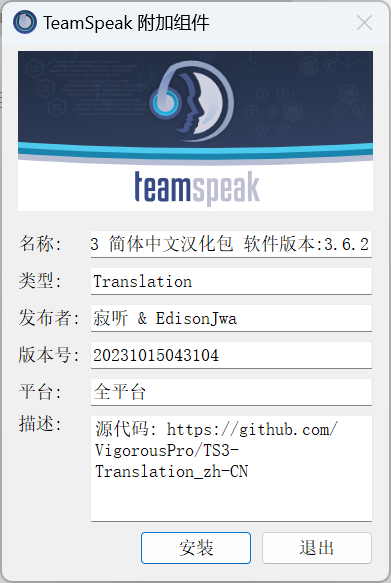

2. 启用汉化

	

4. 安装成功

	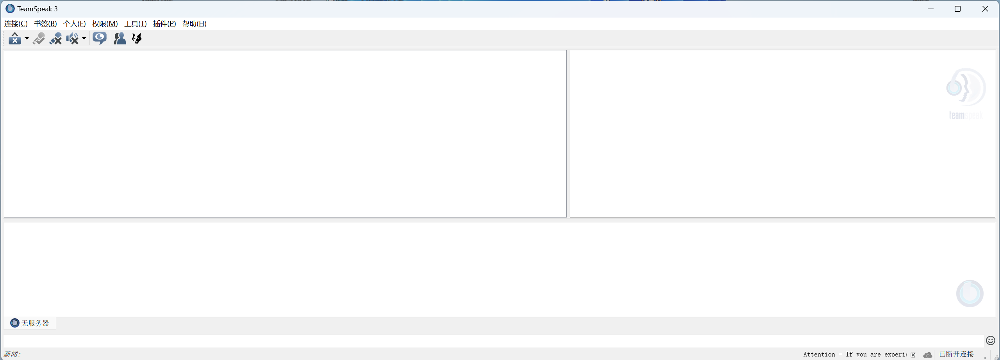

## 使用方法

1. 点击 连接(^^C^^)

	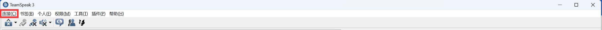

2. 点击 连接至服务器(^^C^^)

	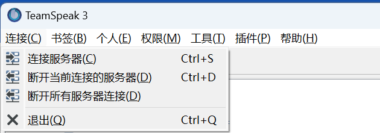

3. 输入以下信息:

	- 服务器别名或地址(^^A^^) : ts.apocfly.com
    - 昵称(^^N^^) : 填写自己注册的CID

	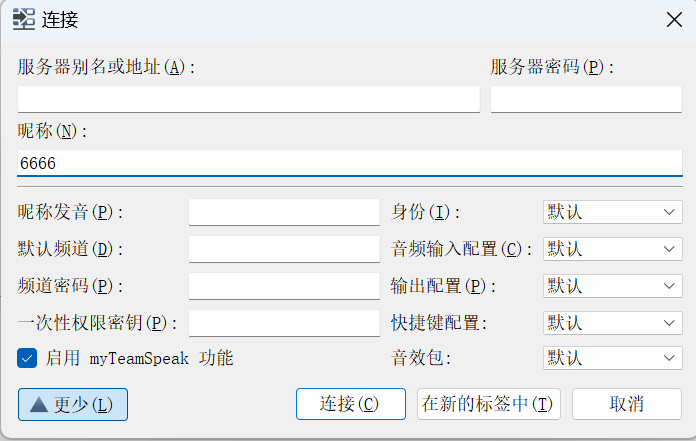

4. 连接成功！

	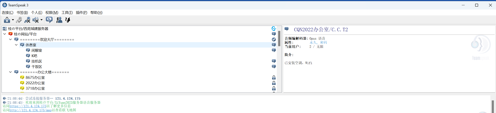

5. 设置PTT(Push To Talk)，依次进入:

	`音频输入` -> `Default` -> `按键通话`，设置一个按键

	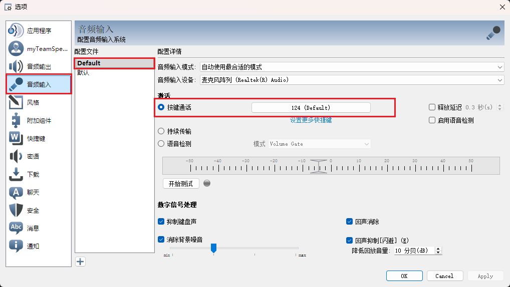

6. 点击右下角的`OK`，完成设置

The end.